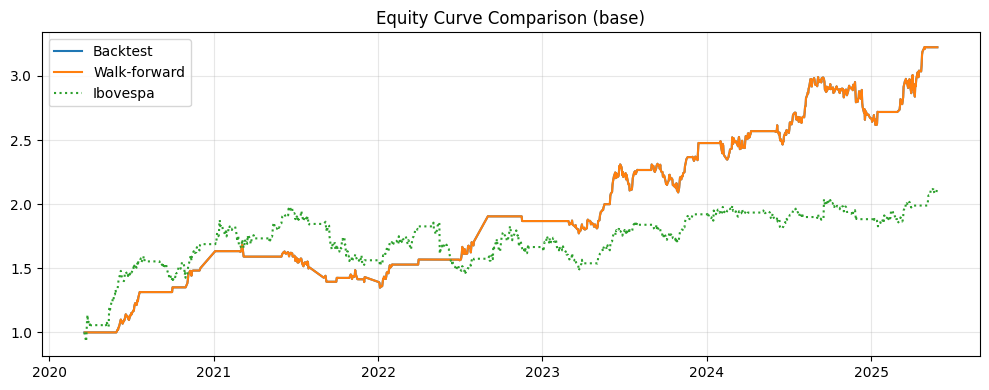
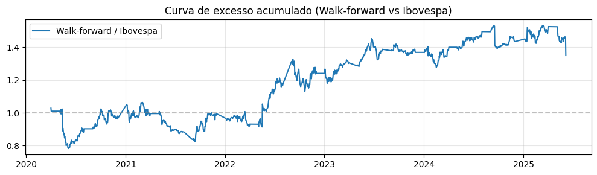
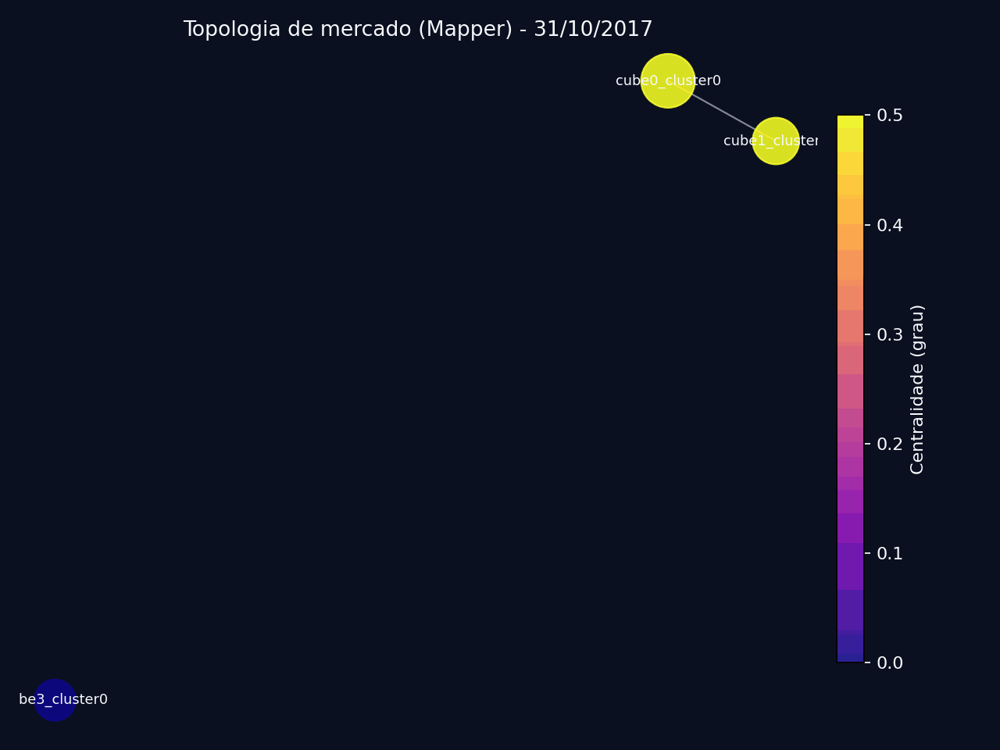

# 🗺️ Atlas: The Market Cartographer
<div align="center">


[](LICENSE)


</div>

> **Regime-Aware Hierarchical Risk Parity with Topological Data Analysis (TDA)**
> *Submissão para o Itaú Quant Challenge 2025*

**Atlas** é um framework de alocação quantitativa que utiliza **Topologia Algébrica** e **Machine Learning** para navegar por diferentes regimes de mercado. Ao contrário de modelos tradicionais baseados apenas em correlação linear, o Atlas usa *Persistent Homology* para detectar turbulência e *Mapper* para clusterizar ativos, gerando um portfólio robusto para o mercado brasileiro de ações (Long-Only).

---

## 🚀 Performance & Resultados
> **Período:** 14/09/2017 a 06/10/2025 (Ibovespa Universe)
> **Validação:** Walk-Forward Analysis (504d Treino / 126d Teste)

O modelo superou consistentemente o Benchmark (Ibovespa) e o CDI, entregando alto retorno ajustado ao risco com proteção contra grandes quedas.

Curvas de Equity (Walk-Forward & Ibovespa):



Indicadores-chave de desempenho (KPIs):

| Métrica | Atlas (Walk-forward) | Ibovespa |
| :--- | :--- | :--- |
| **CAGR** | **0.316** | 0.209 |
| **Sharpe** | **1.181** | 0.549 |
| **Sortino** | **1.903** | 0.813 |
| **Vol** | **0.166** | 0.234 |
| **MaxDD** | **-0.199** | -0.254 |
| **AvgTimeUnderWater** | **20.400** | 30.800 |
| **MaxTimeUnderWater** | **270.000** | 500.000 |
| **Calmar** | **1.590** | 0.821 |
| **HitRate** | **0.542** | 0.515 |
| **Turnover** | **0.017** | NaN |

Indicadores-chave de desempenho (KPIs) para cada janela fora da amostra (OOS) a partir da análise de desempenho:

| Métrica | WF 01 | WF 02 | WF 03 | WF 04 | WF 05 | WF 06 | WF 07 | WF 08 | WF 09 |
| :--- | :--- | :--- | :--- | :--- | :--- | :--- | :--- | :--- | :--- |
| **CAGR** | 1.284 | 0.059 | -0.031 | 0.553 | 0.221 | 0.413 | 0.187 | 0.187 | 0.312 |
| **Sharpe** | 5.080 | 0.254 | -0.360 | 1.698 | 0.706 | 1.302 | 0.522 | 0.547 | 0.882 |
| **Sortino** | 11.760 | 0.401 | -0.448 | 5.643 | 1.307 | 2.051 | 0.836 | 0.818 | 1.281 |
| **Vol** | 0.161 | 0.176 | 0.167 | 0.197 | 0.110 | 0.184 | 0.147 | 0.158 | 0.173 |
| **MaxDD** | -0.039 | -0.099 | -0.132 | -0.033 | -0.053 | -0.097 | -0.058 | -0.069 | -0.094 |
| **AvgTimeUnderWater** | 6.820 | 19.000 | 0.000 | 14.750 | 9.200 | 21.400 | 12.560 | 6.860 | 11.670 |
| **MaxTimeUnderWater** | 29.000 | 37.000 | 0.000 | 45.000 | 23.000 | 57.000 | 36.000 | 19.000 | 60.000 |
| **Calmar** | 32.776 | 0.591 | -0.234 | 16.515 | 4.126 | 4.275 | 3.222 | 2.693 | 3.310 |
| **HitRate** | 0.691 | 0.540 | 0.489 | 0.519 | 0.516 | 0.553 | 0.517 | 0.532 | 0.526 |
| **Turnover** | 0.022 | 0.021 | 0.029 | 0.016 | 0.008 | 0.011 | 0.017 | 0.007 | 0.017 |

Desempenho superior do Walk-forward em comparação com o Ibovespa (Walk-forward / Ibovespa):



Indicadores-chave de desempenho (KPIs) da alocação walk-forward em relação ao Ibovespa (alfa, beta, retorno excedente, erro de rastreamento, índice de informação e correlação):

| Métrica | Atlas vs Ibovespa |
| :--- | :--- |
| **Annualized Alpha** | 0.158 |
| **Beta** | 0.269 |
| **Excess Annual Return** | 0.064 |
| **Tracking Error** | 0.231 |
| **Information Ratio** | 0.277 |
| **Correlation** | 0.377 |

---

## 🧠 A Inovação: Por que Topologia?
Modelos tradicionais falham em crises porque as correlações tendem a 1. O Atlas resolve isso com três motores principais:

### 1. Detector de Turbulência (Persistent Homology)
Em vez de usar volatilidade simples, calculamos a "forma" da nuvem de dados do mercado.
* **Como funciona:** Usamos *Vietoris-Rips filtration* para medir a persistência de "buracos" na topologia do mercado.
* **Efeito Prático:** Quando a estrutura topológica quebra (sinal de crise sistêmica), o algoritmo ativa o modo "Risk-Off" automaticamente, reduzindo a exposição antes que a volatilidade exploda.

### 2. Clusterização via Mapper
Agrupamos ativos não apenas por setor ou correlação, mas por comportamento topológico.
* **O Diferencial:** O algoritmo *Mapper* projeta os ativos em um grafo, identificando quais ações são "periféricas" (idiossincráticas/seguras) e quais são "centrais" (sistêmicas/arriscadas).
* **Aplicação:** O portfólio inclina pesos para ativos periféricos durante incertezas.

### 3. Meta-Blend (Machine Learning)
Um modelo de *Ensemble* (Ridge/ElasticNet) que aprende dinamicamente qual a melhor mistura de fatores (Momentum, Quality, Carry) para o regime atual detectado pela topologia.

---

## 🛠️ Engenharia e Reprodutibilidade
O projeto foi desenhado com rigor de engenharia de software para ser auditável e reprodutível.

### Pipeline de Execução
1.  **Ingestion:** Carregamento de dados e ajuste de universo (Liquidez/Histerese).
2.  **TDA Engine:** Cálculo de *Persistence Landscapes* e grafos *Mapper*.
3.  **ML Layer:** Treinamento do *Meta-Blend* com *Purged K-Fold Cross Validation*.
4.  **Portfolio Optimization:** HRP (Hierarchical Risk Parity) guiado pela estrutura topológica.
5.  **Risk Guards:** Kill-switch baseado em *Drawdown* e controle de *Turnover*.

### Como Rodar
O ambiente é gerenciado via `uv` ou `pip`. Requer Python 3.10+.

```bash
# 1. Instalação
python -m venv .venv
source .venv/bin/activate  # ou .venv\Scripts\activate no Windows
pip install -e ".[dev]"

# 2. Executar Backtest Completo
python -m src.main --mode backtest --config configs/base.yaml

# 3. Gerar Relatório PDF
python -m src.reports.build_pdf --config configs/base.yaml
````

### Usage Snippet (Python)
Execute o pipeline completo a partir de um script/notebook, sem precisar chamar o CLI:

```python
from pathlib import Path

from backtest.engine import run_backtest
from dataio.config import load_config
from dataio.loaders import get_panel

cfg = load_config("configs/base.yaml")
panel = get_panel(cfg["dates"]["start"], cfg["dates"]["end"])

result = run_backtest(cfg, panel=panel)
print(result["kpis"])

equity_path = Path("reports") / "equity_curve_example.csv"
result["equity_curve"].to_csv(equity_path)
print(f"Equity curve salva em: {equity_path}")
```

Tambem é possivel rodar tudo via notebook `notebooks/full_pipeline.ipynb`, que reproduz o pipeline oficial utilizado para gerar os resultados apresentados.

## Mapper TDA (Animation)
Visualizacao da evolucao topologica (Mapper) ao longo do tempo:



Para recriar o GIF a partir dos PNGs ja salvos em `artifacts/tda/mapper_*/mapper_graph.png`:
```bash
python -m scripts.make_mapper_gif --output data/readme_assets/mapper_tda.gif --stride 1 --duration 0.8
```
Se os PNGs estiverem vazios, o script faz fallback para os `graph_*.json` em `artifacts/mapper/`, gerando quadros a partir deles (nodes/edges).
Nota: o GIF atual foi gerado com parametros de visualizacao (mapper: n_cubes=6, overlap=0.4, min_cluster_size=3, eps_quantile=0.3; universe.top_n=25) para forcar grafos preenchidos; isso nao altera o backtest oficial (Sharpe ~1.18).

-----

## 📂 Estrutura do Repositório

```text
.
├── configs/           # Arquivos YAML (Hiperparâmetros do modelo)
├── src/
│   ├── features/      # TDA (Mapper/PH) e Engenharia de Features
│   ├── models/        # Meta-models (ElasticNet/Ridge)
│   ├── backtest/      # Engine de execução e HRP
│   └── risk/          # Gestão de risco e Kill-switches
├── artifacts/         # Saídas geradas (Caches, Modelos salvos)
└── reports/           # PDFs, CSVs de métricas e Gráficos finais
```

-----

## 🔎 Robustez e Validação

Para garantir que os resultados não são fruto de sorte (*p-hacking*), aplicamos:

  * **Deflated P-Value:** 11.6% (Alta confiança de que o Sharpe \> 0 não é ruído).
  * **Sensitivity Analysis:** O modelo mantém performance estável em uma ampla faixa de `target_vol` (12-14%).
  * **Custos Reais:** Simulação inclui *slippage* não-linear e taxas de corretagem.

---

## 📄 Licença e Direitos Autorais

© 2025 Atlas Project.

Este projeto está licenciado sob a licença MIT. Você é livre para usar, modificar e distribuir este software, desde que inclua os créditos originais. Consulte o arquivo [LICENSE](LICENSE) para ler o texto completo.
