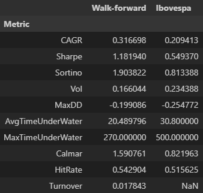
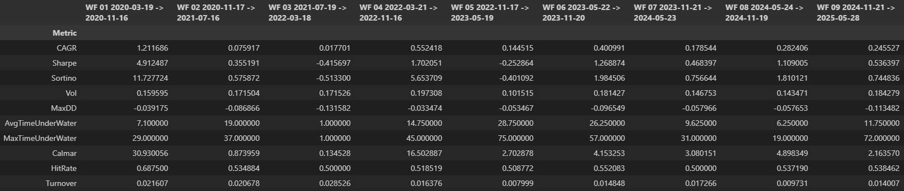
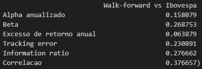

# 🗺️ Atlas: The Market Cartographer
> **Regime-Aware Hierarchical Risk Parity with Topological Data Analysis (TDA)**
> *Submissão para o Itaú Quant Challenge 2025*

**Atlas** é um framework de alocação quantitativa que utiliza **Topologia Algébrica** e **Machine Learning** para navegar por diferentes regimes de mercado. Ao contrário de modelos tradicionais baseados apenas em correlação linear, o Atlas usa *Persistent Homology* para detectar turbulência e *Mapper* para clusterizar ativos, gerando um portfólio robusto para o mercado brasileiro de ações (Long-Only).

---

## 🚀 Performance & Resultados
> **Período:** 14/09/2017 a 06/10/2025 (Ibovespa Universe)
> **Validação:** Walk-Forward Analysis (504d Treino / 126d Teste)

O modelo superou consistentemente o Benchmark (Ibovespa) e o CDI, entregando alto retorno ajustado ao risco com proteção contra grandes quedas.

Curvas de Equity (Walk-Forward & Ibovespa):


| Métrica | Atlas (Walk-forward) | Ibovespa |
| :--- | :--- | :--- |
| **CAGR** | **0.316** | 0.209 |
| **Sharpe** | **1.181** | 0.549 |
| **Sortino** | **1.903** | 0.813 |
| **Vol** | **0.166** | 0.234 |
| **MaxDD** | **-0.199** | -0.254 |
| **AvgTimeUnderWater** | **20.4** | 30.8 |
| **MaxTimeUnderWater** | **270** | 500 |
| **Calmar** | **1.590** | 0.821 |
| **HitRate** | **0.542** | 0.515 |
| **Turnover** | **0.017** | NaN |



KPIs for each out-of-sample window from walk-forward:



Walk-forward excess performance over the Ibovespa (Walk-forward / Ibovespa):


KPIs of the walk-forward allocation against the Ibovespa (alpha, beta, excess return, tracking error, information ratio, and correlation):



---

## 🧠 A Inovação: Por que Topologia?
Modelos tradicionais falham em crises porque as correlações tendem a 1. O Atlas resolve isso com três motores principais:

### 1. Detector de Turbulência (Persistent Homology)
Em vez de usar volatilidade simples, calculamos a "forma" da nuvem de dados do mercado.
* **Como funciona:** Usamos *Vietoris-Rips filtration* para medir a persistência de "buracos" na topologia do mercado.
* **Efeito Prático:** Quando a estrutura topológica quebra (sinal de crise sistêmica), o algoritmo ativa o modo "Risk-Off" automaticamente, reduzindo a exposição antes que a volatilidade exploda.

### 2. Clusterização via Mapper
Agrupamos ativos não apenas por setor ou correlação, mas por comportamento topológico.
* **O Diferencial:** O algoritmo *Mapper* projeta os ativos em um grafo, identificando quais ações são "periféricas" (idiossincráticas/seguras) e quais são "centrais" (sistêmicas/arriscadas).
* **Aplicação:** O portfólio inclina pesos para ativos periféricos durante incertezas.

### 3. Meta-Blend (Machine Learning)
Um modelo de *Ensemble* (Ridge/ElasticNet) que aprende dinamicamente qual a melhor mistura de fatores (Momentum, Quality, Carry) para o regime atual detectado pela topologia.

---

## 🛠️ Engenharia e Reprodutibilidade
O projeto foi desenhado com rigor de engenharia de software para ser auditável e reprodutível.

### Pipeline de Execução
1.  **Ingestion:** Carregamento de dados e ajuste de universo (Liquidez/Histerese).
2.  **TDA Engine:** Cálculo de *Persistence Landscapes* e grafos *Mapper*.
3.  **ML Layer:** Treinamento do *Meta-Blend* com *Purged K-Fold Cross Validation*.
4.  **Portfolio Optimization:** HRP (Hierarchical Risk Parity) guiado pela estrutura topológica.
5.  **Risk Guards:** Kill-switch baseado em *Drawdown* e controle de *Turnover*.

### Como Rodar
O ambiente é gerenciado via `uv` ou `pip`. Requer Python 3.10+.

```bash
# 1. Instalação
python -m venv .venv
source .venv/bin/activate  # ou .venv\Scripts\activate no Windows
pip install -e ".[dev]"

# 2. Executar Backtest Completo
python -m src.main --mode backtest --config configs/base.yaml

# 3. Gerar Relatório PDF
python -m src.reports.build_pdf --config configs/base.yaml
````

-----

## 📂 Estrutura do Repositório

```text
.
├── configs/           # Arquivos YAML (Hiperparâmetros do modelo)
├── src/
│   ├── features/      # TDA (Mapper/PH) e Engenharia de Features
│   ├── models/        # Meta-models (ElasticNet/Ridge)
│   ├── backtest/      # Engine de execução e HRP
│   └── risk/          # Gestão de risco e Kill-switches
├── artifacts/         # Saídas geradas (Caches, Modelos salvos)
└── reports/           # PDFs, CSVs de métricas e Gráficos finais
```

-----

## 🔎 Robustez e Validação

Para garantir que os resultados não são fruto de sorte (*p-hacking*), aplicamos:

  * **Deflated P-Value:** 11.6% (Alta confiança de que o Sharpe \> 0 não é ruído).
  * **Sensitivity Analysis:** O modelo mantém performance estável em uma ampla faixa de `target_vol` (12-14%).
  * **Custos Reais:** Simulação inclui *slippage* não-linear e taxas de corretagem.
